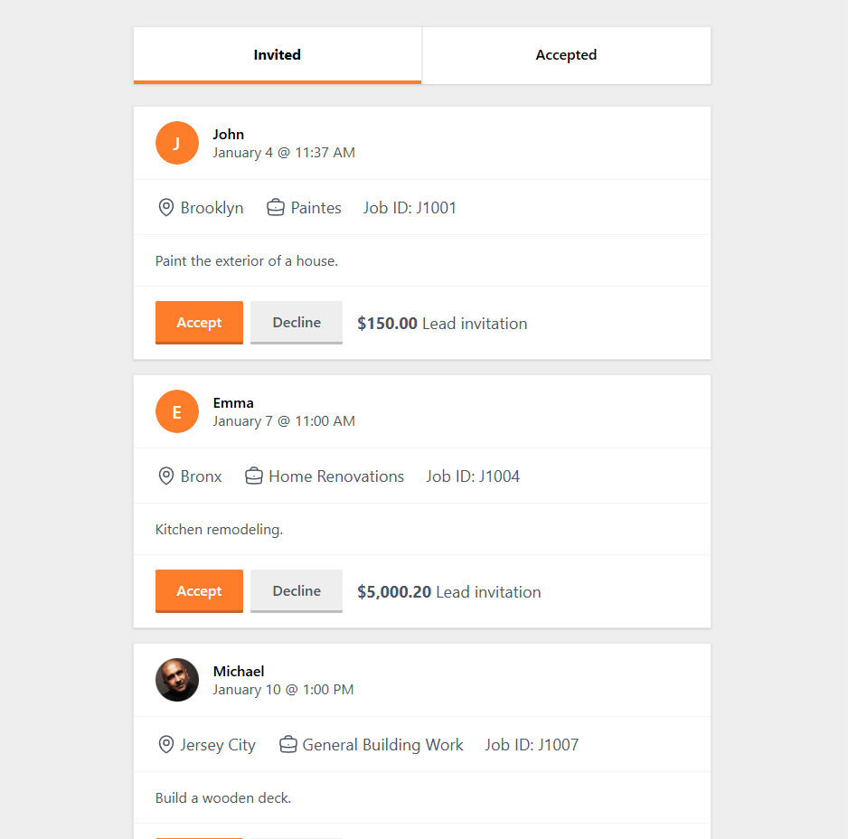

# Lead Management Frontend

Frontend challenge to **recreate a lead management interface** that interacts with a **RESTful API** built in .NET. The application features two main sections:

- **Invited Leads** tab
- **Accepted Leads** tab



## 🚀 Tech Stack

- **React 19 + Vite** – Fast development environment
- **TailwindCSS** – Modern styling
- **React Query** – Data fetching and caching
- **Radix UI** – Accessible UI components
- **Axios** – API requests

## 🔧 Setup & Installation

### **Prerequisites**

Ensure you have **pnpm** installed:

```sh
npm install -g pnpm
```

### **Clone & Install Dependencies**

```sh
git clone git@github.com:odanilo/lead-management-frontend.git
cd front
pnpm install
```

### **Environment Variables**

Create a `.env.local` file and add the api URL:

```sh
VITE_API_URL=http://localhost:8080/
```

### **Run the Project**

```sh
pnpm run dev
```

The app will be available at `http://localhost:5173/`.

## 📌 Features

- Displays leads in **Invited** and **Accepted** tabs
- Calls a **RESTful API** (to be defined)
- Allows updating lead status

## 🔬 Testing

Before running the tests, uncomment the code inside `getLeadsRepository` to enable API calls, allowing Cypress to intercept them properly.

```ts
export const getLeadsRepository = async (
  params?: GetLeadsRepositoryParams,
): Promise<{ data: GetLeadsRepositoryResponse }> => {
  return await httpClient.get<GetLeadsRepositoryResponse>('leads', {
    params,
  });
};
```

After that, to execute the tests, run:

```
pnpm cy:open
```

Then, navigate to **"E2E Tests"** and select the home.cy.ts spec to run.

## 📄 License

This project is for challenge purposes.
